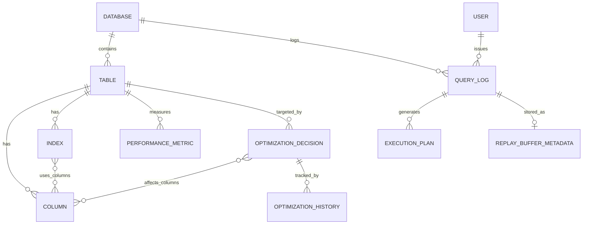

# Database Design Report: Continual Learning Database Engine (CLDB)

**Project Name:** Continual Learning Database Engine (CLDB)  
**Module:** Metadata Repository & Query Auditing Subsystem

---

## 1. Introduction

The CLDB system utilizes a PostgreSQL database to maintain an active metadata repository. This repository tracks schemas, queries, execution plans, and optimization decisions made by the Continual Learning Engine. This report outlines the Entity-Relationship (ER) design, the relational mapping, and the normalization process for the database schema.

---

## 2. Entity-Relationship (ER) / EER Model

### 2.1 Entities and Key Attributes
1. **User**: Represents a database user.
   - Attributes: `user_id` (PK), `username`, `created_at`
2. **Database**: Represents a tracked database instance.
   - Attributes: `db_id` (PK), `db_name`, `created_at`
3. **Table**: Represents a database table.
   - Attributes: `table_id` (PK), `schema_name`, `table_name`, `row_count_estimate`
4. **Column**: Represents a column within a table.
   - Attributes: `column_id` (PK), `column_name`, `data_type`
5. **Index**: Represents a database index.
   - Attributes: `index_id` (PK), `index_name`, `is_active`, `created_at`, `dropped_at`
6. **QueryLog**: Records executed SQL queries.
   - Attributes: `query_id` (PK), `query_text`, `query_hash`, `execution_time_ms`, `executed_at`
7. **ExecutionPlan**: Stores query execution plans.
   - Attributes: `plan_id` (PK), `plan_json`, `estimated_cost`, `created_at`
8. **PerformanceMetric**: Logs performance stats for tables.
   - Attributes: `metric_id` (PK), `metric_name`, `metric_value`, `recorded_at`
9. **OptimizationDecision**: Records the AI model's index decisions.
   - Attributes: `decision_id` (PK), `action`, `confidence_score`, `estimated_cost_saving`, `status`, `created_at`, `executed_at`
10. **OptimizationHistory**: Tracks state changes of optimization decisions.
    - Attributes: `history_id` (PK), `action`, `status`, `recorded_at`
11. **ReplayBufferMetadata**: ML replay buffer tracking.
    - Attributes: `buffer_id` (PK), `importance_score`, `is_active`, `added_at`

### 2.2 Relationships
- A **User** *issues* many **QueryLogs** (1:N).
- A **Database** *contains* many **Tables** (1:N).
- A **Database** *logs* many **QueryLogs** (1:N).
- A **Table** *has* many **Columns** (1:N).
- A **Table** *has* many **Indexes** (1:N).
- A **Table** *has* many **PerformanceMetrics** (1:N).
- A **Table** is the *target of* many **OptimizationDecisions** (1:N).
- An **Index** is *composed of* many **Columns** (M:N).
- An **OptimizationDecision** *affects* many **Columns** (M:N).
- A **QueryLog** *generates* an **ExecutionPlan** (1:N).
- A **QueryLog** *is stored in* **ReplayBufferMetadata** (1:1).
- An **OptimizationDecision** *has* many **OptimizationHistory** logs (1:N).

---

## 3. Relational Mapping (Logical Design)

The ER diagram is mapped into the following relational schemas. Primary keys are denoted with **(PK)** and foreign keys with *(FK)*.

- **users** (<u>user_id</u>, username, created_at)
- **databases** (<u>db_id</u>, db_name, created_at)
- **tables** (<u>table_id</u>, *db_id*, schema_name, table_name, row_count_estimate)
- **columns** (<u>column_id</u>, *table_id*, column_name, data_type)
- **indexes** (<u>index_id</u>, *table_id*, index_name, is_active, created_at, dropped_at)
- **index_columns** (<u>*index_id*, *column_id*</u>)
- **query_logs** (<u>query_id</u>, *db_id*, *user_id*, query_text, query_hash, execution_time_ms, executed_at)
- **execution_plans** (<u>plan_id</u>, *query_id*, plan_json, estimated_cost, created_at)
- **performance_metrics** (<u>metric_id</u>, *table_id*, metric_name, metric_value, recorded_at)
- **optimization_decisions** (<u>decision_id</u>, *table_id*, action, confidence_score, estimated_cost_saving, status, created_at, executed_at)
- **optimization_decision_columns** (<u>*decision_id*, *column_id*</u>)
- **optimization_history** (<u>history_id</u>, *decision_id*, *table_id*, action, status, recorded_at)
- **replay_buffer_metadata** (<u>buffer_id</u>, *query_id*, importance_score, is_active, added_at)

---

## 4. Normalization (Up to BCNF)

### 4.1 First Normal Form (1NF)
**Condition:** All attributes must contain atomic values, and each record must be unique.
**Status:** The current schema adheres to 1NF. There are no multi-valued attributes, no arrays, and every table has a defined `PRIMARY KEY`.

### 4.2 Second Normal Form (2NF)
**Condition:** Must be in 1NF, and all non-key attributes must be fully functionally dependent on the entire primary key (no partial dependencies).
**Status:** The schema utilizes surrogate keys (e.g., `SERIAL PRIMARY KEY`) consisting of a single attribute for all primary entities. A single-column primary key cannot have partial dependencies. 
For associative tables (`index_columns`, `optimization_decision_columns`), the primary key is a composite key `(index_id, column_id)`. Neither table has non-key attributes, meaning 2NF is automatically satisfied.

### 4.3 Third Normal Form (3NF)
**Condition:** Must be in 2NF, and no non-key attribute is transitively dependent on the primary key.
**Analysis:** 
- In `tables`, `table_name` and `schema_name` depend strictly on `table_id`.
- In `query_logs`, `query_text`, `execution_time_ms`, etc., depend strictly on `query_id`.
- **Deviation discovered:** In the `optimization_history` table, both `decision_id` and `table_id` are stored. 
  - `history_id -> decision_id`
  - `decision_id -> table_id` (via the `optimization_decisions` table).
  - Therefore, `history_id -> table_id` is a transitive dependency.
  - **Resolution for strict 3NF:** Remove `table_id` from `optimization_history` since it can be derived by joining `optimization_decisions`. However, in a production environment, this is often kept for denormalization to improve query performance on audit logs. For strict academic BCNF purposes, `table_id` should be dropped from this relation.

### 4.4 Boyce-Codd Normal Form (BCNF)
**Condition:** For every non-trivial functional dependency $X \rightarrow Y$, $X$ must be a superkey.
**Analysis:** 
- Looking at `tables`: The candidate keys are `table_id` and the composite `(db_id, schema_name, table_name)` (due to the `UNIQUE` constraint). Both uniquely identify the row and act as superkeys.
- Looking at `columns`: Candidate keys are `column_id` and `(table_id, column_name)`. Both are superkeys.
- This pattern holds true for `indexes` and `databases` due to their explicit `UNIQUE` constraints. 
- Assuming the 3NF transitive dependency in `optimization_history` is resolved, the schema is **fully BCNF compliant**.

---
*End of Report*
